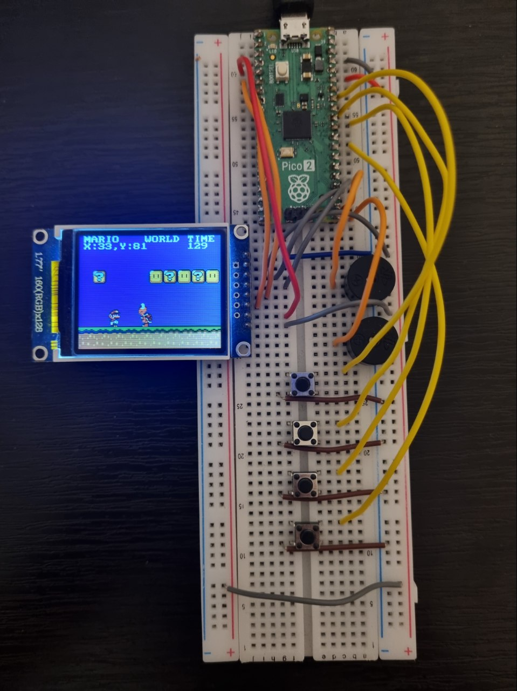

# Super-Mario-Pico
A basic Super Mario demo written in C for RP2350 Hazard3 cores. (Still WIP)

# Hardware
PCB coming soon

Basic breadboard setup:

# Licensing
This software is developed and distributed with [GPL 3.0](LICENSE) by Tan S. Akinci. [ST7735_TFT_PICO](https://github.com/gavinlyonsrepo/ST7735_TFT_PICO) library is developed and distributed with GPL 3.0 by Gavin Lyon. Super Mario is a trademark of Nintendo. All Super Mario World tiles and sprites, and all Super Mario tunes used in this software are Nintendo's property and are not part of the licensing of the software. This software is a fan project. Developers of this software are not responsible for potential copyright and trademark infringements.
